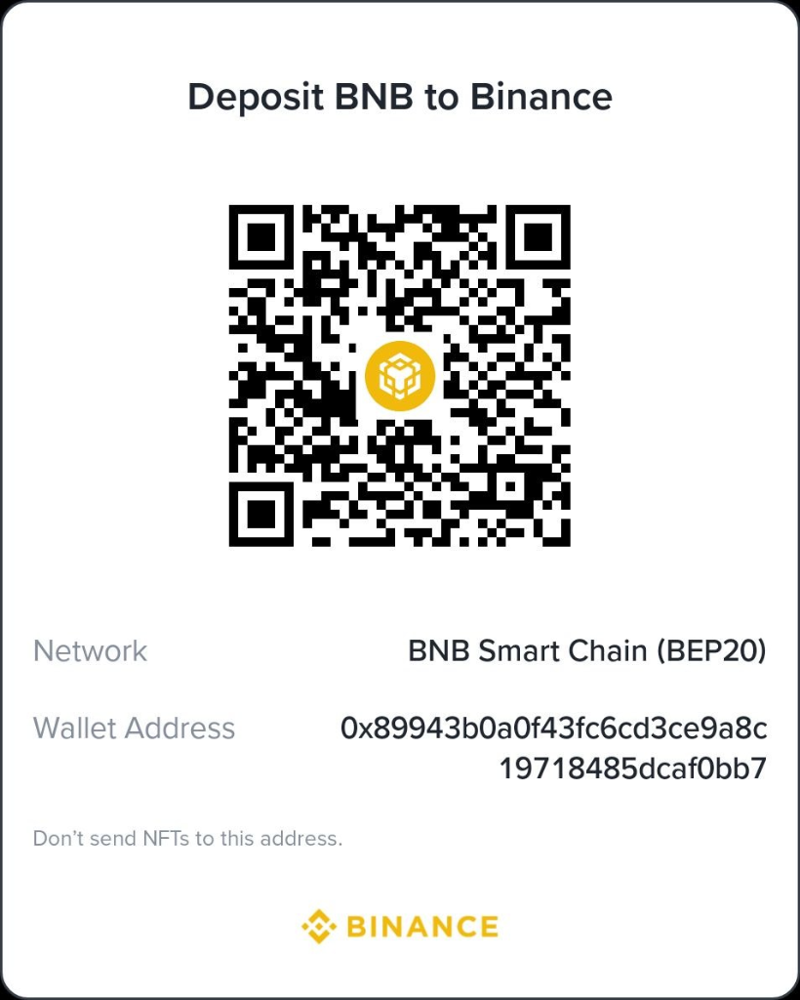

# Grid Trading Bot for Binance

[](https://www.python.org/)
[](https://binance-docs.github.io/apidocs/spot/en/)
[](http://127.0.0.1:8000)
[](https://opensource.org/licenses/MIT)

**Grid Trading Bot**, kripto para piyasalarında belirlenen fiyat aralıklarında otomatik olarak parçalı alım-satım yaparak piyasa dalgalanmalarından (volatilite) kâr sağlayan algoritmik bir ticaret botudur.

Bu depo, hem **v1.0 Klasik Konsol Sürümünü** hem de kurumsal güvenlik önlemleri, tek ekranlı modern web yönetim paneli, kazanç simülatörü ve `.bat` başlatıcı üreticisi içeren **v1.2 Pro / Safety Edition** sürümünü içerir.

<p align="center">
  
</p>

---

## ⚡ Sürüm Karşılaştırması

| Özellik | v1.0 (Klasik Sürüm) | v1.2 Pro (Gelişmiş Sürüm) |
| :--- | :---: | :---: |
| **Yönetim Arayüzü** | Konsol / Terminal | 🌐 **Tek Ekranlı Web Dashboard (FastAPI + JS)** |
| **Simülasyon Modu** | Harici `simulation.py` | 📊 **Tek ekranda 4 piyasa senaryolu canlı simülatör** |
| **Başlatıcı Üretimi** | Manuel düzenleme | 🚀 **Web ekranından tek tıkla özel `.bat` dışa aktarma** |
| **Durum Saklama** | Standart JSON | 🛡️ **Atomik JSON (`runtime_state.json`), sıfır veri kaybı** |
| **Çoklu Süreç Kilidi** | Yok | 🔒 **`47821` portu üzerinden Single-Instance Soket Kilidi** |
| **Emir Güvenliği (Idempotency)** | Temel | ⚡ **Deterministik `clientOrderId` takibi ve kurtarma** |
| **Sayısal Hassasiyet** | Standart `float` | 🎯 **Yüksek hassasiyetli `Decimal` + Binance Filtreleri** |
| **Canlı İşlem Koruması** | Doğrudan API çağrısı | 🔑 **`I_UNDERSTAND_LIVE_ORDERS` güvenlik onay kilidi** |
| **Dahili Güvenlik Testi** | Yok | 🧪 **20.480 durum patikasıyla çalışan dahili `self-test`** |

---

## 🚀 Hızlı Başlangıç

### 1. Bağımlılıkların Kurulması
```bash
pip install -r requirements.txt
```

---

### 2. v1.2 Pro Web Dashboard'u Başlatma (Tavsiye Edilen)
Tek ekrandan tüm ayarları yapmak, kazanç simülasyonunu izlemek ve özel `.bat` başlatıcısı üretmek için:

- Windows üzerinde **`run_v1.2_dashboard.bat`** dosyasına çift tıklayın.
- Veya komut satırından:
  ```bash
  cd v1.2
  run_dashboard.bat
  ```
- Tarayıcınız otomatik olarak açılacaktır: **`http://127.0.0.1:8000`**

#### Web Dashboard Yetenekleri:
- **Tek Ekrandan Tam Kontrol:** Sembol, alt/üst fiyat, grid sayısı, bakiye, çalışma modu (Paper/Testnet/Live) tek sayfada.
- **Canlı Metrikler:** Grid adım büyüklüğü, sektör sayısı (`grid_number + 1`), adım yüzdesi ve sektör başı bakiye anında hesaplanır.
- **Etkileşimli Simülasyon:** Yatay dalgalı, boğa, ayı veya şok volatilite piyasalarında al/sat noktalarını, kümülatif kâr eğrisini ve maksimum drawdown oranını grafik üzerinde canlı simüle edin.
- **Özel `.BAT` Üretici:** Arayüzdeki parametrelere göre tek tıkla `start_custom_bot.bat` oluşturup diske kaydedin veya tarayıcıdan indirin.
- **Dahili Self-Test:** 20.480 kombinasyonlu güvenlik testini tek tıkla ekrandan çalıştırın.

<p align="center">
  
</p>

---

### 3. v1.2 Gelişmiş Konsol Botu
Doğrudan konsoldan v1.2 motorunu çalıştırmak için:
```bash
cd v1.2
python main.py --self-test    # 20.480 durum patikalı güvenlik testi
python main.py                # Botu başlat (config.json ayarlarına göre)
```
*(veya `v1.2/start_bot.bat` dosyasına çift tıklayın).*

---

### 4. v1.0 Klasik Sürüm (Konsol & Matplotlib Simülatörü)
- **Risksiz Simülatör:** `python simulation.py` *(veya `run_simulation.bat`)*
- **Canlı Bot:** `python main.py` *(veya `run_bot.bat`)*

---

## 🏗️ Matematiksel Model ve Sektör Mimarisi

Bot, sermayenizi ve fiyat aralığınızı matematiksel olarak eşit parçalara bölerek sektörlere ayırır:

```
higher_zone ──── [Price_High, ∞] ─────────────────> Tavan bölgesi (Tüm varlıklar satılır)
sector 5    ──── [Price_High - 1x, Price_High] ───> SELL / BUY Koridoru
sector 4    ──── [Price_Low + 3x, Price_Low + 4x]─> SELL / BUY Koridoru
sector 3    ──── [Price_Low + 2x, Price_Low + 3x]─> SELL / BUY Koridoru
sector 2    ──── [Price_Low + 1x, Price_Low + 2x]─> SELL / BUY Koridoru
sector 1    ──── [Price_Low, Price_Low + 1x] ─────> En alt alım koridoru
dead_zone   ──── [0, Price_Low] ──────────────────> Taban bölgesi (Bekleme)
```

### Hesaplama Formülleri:
```python
# 1. Toplam Sektör Sayısı:
Grid_Area = Grid_Number + 1

# 2. Sektör Başına Düşen Bakiye ($):
Sector_Balance = Balance / Grid_Area

# 3. Grid Fiyat Genişliği ($):
Grid_balance = (Price_High - Price_Low) / Grid_Area
```

### Sektör Durum Makinesi (State Machine):
Her sektör 2 farklı durumdan birinde bulunur:
- **`"$"` (Nakit Durumu):** Sektör nakittedir. Fiyat bir üst sektörden bu sektöre düştüğünde anında `Sector_Balance` tutarında **ALIM** yapar ve durumunu `"A"`ya çevirir.
- **`"A"` (Varlık Durumu):** Sektörde kripto varlık tutulmaktadır. Fiyat bu sektörden bir üst sektöre yükseldiğinde pozisyon kârla **SATILIR** ve durum tekrar `"$"**a döner.

---

## 📁 Proje Dosya Yapısı

```
Grid_trading/
│
├── run_v1.2_dashboard.bat     # v1.2 Web Dashboard'u kökten tek tıkla başlatan dosya
├── requirements.txt           # Ortak Python bağımlılıkları
├── README.md                  # Genel proje dokümantasyonu
│
├── v1.2/                      # Gelişmiş Güvenlikli Sürüm (v1.2 Pro)
│   ├── main.py                # Orijinal v1.2 çekirdek kodu (İlhan Koçaslan)
│   ├── config.json            # Yapılandırma şablonu
│   ├── start_bot.bat          # v1.2 konsol başlatıcısı
│   ├── run_dashboard.bat      # v1.2 Web Dashboard başlatıcısı
│   ├── requirements.txt       # Dashboard & bot bağımlılıkları
│   ├── README.md              # v1.2 özel detaylı kılavuz
│   └── dashboard/             # Web Dashboard modülü
│       ├── server.py          # FastAPI arka plan servisi & simülasyon motoru
│       └── static/            # Tek ekranlı web arayüzü (HTML/CSS/JS)
│           ├── index.html     # Dashboard ana ekranı
│           ├── style.css      # Binance Pro karanlık teması
│           └── app.js         # Reaktif grafik ve .bat üretici motoru
│
├── main.py                    # v1.0 klasik canlı bot
├── simulation.py              # v1.0 klasik simülatör
├── run_bot.bat                # v1.0 bot başlatıcısı
├── run_simulation.bat         # v1.0 simülatör başlatıcısı
├── balance.json               # v1.0 durum dosyası
├── loggrid.json               # v1.0 işlem logları
└── assets/
    └── bnb_qr.png             # Bağış QR kodu
```

---

## 🔒 Güvenlik & Risk Bildirimi

- **API İzinleri:** Binance üzerinde API anahtarı oluştururken **"Enable Spot & Margin Trading"** seçeneğini açın; ancak **"Enable Withdrawals" (Para Çekme) iznini KESİNLİKLE KAPALI** tutun.
- **Çift Güvenlik Onayı:** v1.2'de canlı işlem (`live` mod) yapabilmek için `config.json` veya web arayüzündeki `live_trading_confirmation` alanına `"I_UNDERSTAND_LIVE_ORDERS"` yazılması zorunludur.
- **Risk Uyarısı:** Kripto para ticareti yüksek volatilite ve risk içerir. Canlıya almadan önce mutlaka `paper` modunda veya web dashboard üzerindeki simülatörde stratejinizi test ediniz.

---

## 👨‍💻 Yazar & Destek

- **İlhan Koçaslan** — [GitHub: @Proaiml](https://github.com/Proaiml)
- **BNB Smart Chain (BEP20) Cüzdan:** `0x89943b0a0f43fc6cd3ce9a8c19718485dcaf0bb7`

<p align="left">
  
</p>
