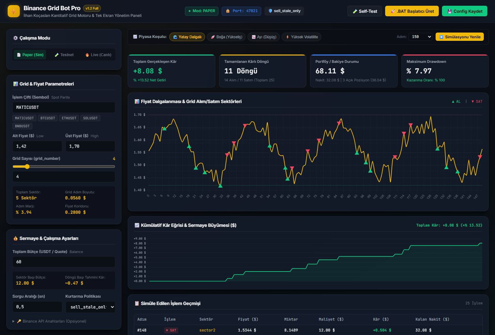
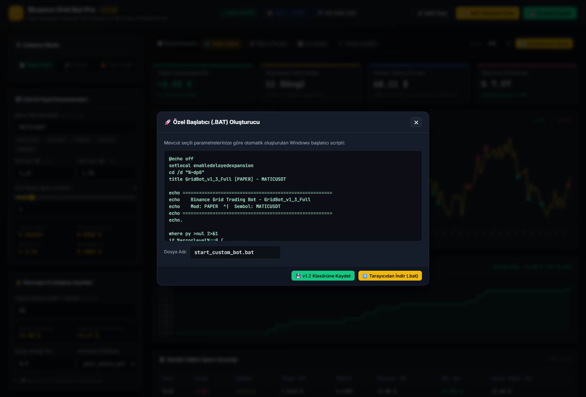

# Binance Grid Trading Bot v1.2 Pro / Safety Edition

[](https://www.python.org/)
[](https://binance-docs.github.io/apidocs/spot/en/)
[](http://127.0.0.1:8000)
[](https://opensource.org/licenses/MIT)

**Grid Trading Bot v1.2 Pro**, İlhan Koçaslan'ın orijinal sektör bazlı histerezis (`$ / A`) stratejisini temel alan; güvenli durum kaydı, atomik durum kurtarma, tek ekranlı etkileşimli web yönetim paneli, kazanç simülatörü ve dışarıya `.bat` üretici modülleriyle donatılmış gelişmiş algoritmik ticaret sistemidir.

> **Sürüm adı hakkında:** Klasörün adı `v1.2`'dir; içindeki bot motoru (`v1.2/main.py`) kendini "v1.3 Full / Safety Edition" olarak tanıtır ve `config.json`'daki bot adı `GridBot_v1_3_Full`'dur. Bu belgelerde "v1.2" bu klasördeki sürümün tamamını ifade eder.

---

## 🌟 v1.2 Sürümündeki Yenilikler ve Güvenlik Mimarisi

| Özellik | v1.0 Orijinal Sürüm | v1.2 Pro / Safety Edition |
| :--- | :---: | :---: |
| **Arayüz & Kontrol** | Konsol / Terminal | **Tek Ekranlı Web Dashboard & Simülatör (FastAPI + JS)** |
| **Simülasyon Modu** | Harici `simulation.py` | **Tek ekranda 4 farklı piyasa senaryosuyla anlık görsel simülasyon** |
| **Başlatıcı Üretimi** | Sabit `.bat` dosyası | **Arayüzden tek tıkla özel `.bat` ve `config.json` dışa aktarma** |
| **Durum Kaydı (Persistence)** | Basit JSON | **Atomik JSON yazımı (`runtime_state.json`); emir gönderilmeden önce bekleyen emir diske yazılır, elektrik/ağ kopmasından sonra bot aynı emri Binance'ten sorgulayarak kaldığı yerden devam eder** |
| **Emir Güvenliği (Idempotency)** | Rastgele / Standart | **Deterministik `clientOrderId` takibi; ağ kopmasında mükerrer emir engeli** |
| **Hassasiyet & Yuvarlama** | Standart `float` | **Yüksek hassasiyetli `Decimal` + Binance LOT_SIZE & MIN_NOTIONAL filtre uyumu** |
| **Çoklu Çalışma Koruması** | Yok | **`47821` portu üzerinden Single-Instance Socket Kilidi** |
| **Canlı İşlem Koruması** | Doğrudan API çağrısı | **`I_UNDERSTAND_LIVE_ORDERS` güvenlik koduyla çift kilit mekanizması** |
| **Dahili Güvenlik Testi** | Yok | **Dahili `self-test`: 5 başlangıç sektörü × 2¹² yukarı/aşağı fiyat yolu = 20.480 durum patikası** |

---

## 🖥️ Tek Ekranlı Web Dashboard

v1.2, botu komut satırından çalıştırmanın ötesinde, tarayıcınızdan tek bir ekran üzerinden yönetmenizi sağlar:

1. **Tüm Parametrelerin Canlı Yönetimi:**
   - İşlem çifti (`symbol`), alt fiyat (`price_low`), üst fiyat (`price_high`), grid sayısı (`grid_number`) ve toplam bütçe (`total_quote_budget`).
   - Sektör sayısı (`grid_number + 1`), sektör başı bütçe ($) ve grid adım genişliği ($ / %) anlık olarak hesaplanır.
2. **Etkileşimli Kazanç Simülasyonu:**
   - Farklı piyasa koşullarını (Yatay Dalgalı, Boğa Trendi, Ayı Trendi, Yüksek Volatilite) seçerek fiyatın sektörler arasındaki geçişlerini izleyin.
   - Grafik üzerinde yeşil alış (▲) ve kırmızı satış (▼) bayraklarını, kümülatif kâr eğrisini ve maksimum drawdown riskini inceleyin.
3. **Dışarıya Özel `.BAT` Başlatıcı Aktarma:**
   - Panelden yapılandırdığınız ayarlara özel `start_custom_bot.bat` dosyasını tek tıkla `v1.2/` klasörüne kaydedebilir veya bilgisayarınıza indirebilirsiniz.
4. **Tek Tıkla Güvenlik Doğrulaması:**
   - Paneldeki **"Self-Test"** butonuyla botun 20.480 durum kombinasyonunu anında doğrulayabilirsiniz.

<p align="center">
  
</p>

<p align="center">
  
</p>

---

## 🚀 Hızlı Başlangıç

### 1. Web Dashboard'u Başlatma (Tavsiye Edilen)
Windows üzerinde doğrudan `run_dashboard.bat` dosyasına çift tıklayın:
```bat
run_dashboard.bat
```
Tarayıcınız otomatik olarak açılacaktır: **`http://127.0.0.1:8000`**

### 2. Konsol Üzerinden Başlatma
Doğrudan konsoldan çalıştırmak için:
```bash
# Dahili testleri çalıştırma
python main.py --self-test

# Botu başlatma (config.json ayarlarına göre)
python main.py
```
*(veya **`start_bot.bat`** dosyasına çift tıklayın).*

---

## ⚙️ Yapılandırma Kılavuzu (`config.json`)

```json
{
  "bot_name": "GridBot_v1_3_Full",
  "mode": "paper",
  "api_key": "BINANCE_API_KEY",
  "api_secret": "BINANCE_API_SECRET",
  "live_trading_confirmation": "",

  "symbol": "MATICUSDT",
  "price_low": "1.42",
  "price_high": "1.70",
  "grid_number": 4,
  "total_quote_budget": "60",

  "poll_interval_seconds": 0.5,
  "restart_recovery_policy": "sell_stale_only",
  "instance_lock_port": 47821
}
```

### Çalışma Modları:
- **`paper`:** Emir göndermez; gerçek piyasa fiyatlarıyla sanal işlem yapar.
- **`testnet`:** Binance Spot Testnet ortamında sanal bakiye ile canlı API testi yapar.
- **`live`:** Gerçek Binance Spot hesabınızda işlem yapar. **Güvenlik gereği, `live_trading_confirmation` alanına `"I_UNDERSTAND_LIVE_ORDERS"` yazılmadıkça bot başlamaz.**

---

## 📁 Dizin Yapısı

```
v1.2/
│
├── main.py                # Bot motoru (strateji: İlhan Koçaslan)
├── config.json            # Bot yapılandırma dosyası
├── start_bot.bat          # Konsol başlatıcısı
├── run_dashboard.bat      # Tek tıkla Web Dashboard başlatıcısı
├── requirements.txt       # Gerekli bağımlılıklar
│
└── dashboard/             # Web Dashboard modülü
    ├── server.py          # FastAPI arka plan servisi & simülasyon motoru
    └── static/            # Tek ekranlı karanlık mod web arayüzü
        ├── index.html     # Dashboard HTML yapısı
        ├── style.css      # Binance Pro karanlık tema CSS
        └── app.js         # Reaktif grafik ve .bat üretici JS
```

---

## 🔒 Güvenlik & Önemli Uyarılar

1. **Kâr garantisi yoktur:** Bot, fiyat aralığın içinde dalgalandığı sürece çalışır; borsa ve ağ kaynaklı riskleri ortadan kaldıramaz.
2. **API İzinleri:** Binance API anahtarlarınızda yalnızca **Spot Trading** izni verin; **Withdrawals (Para Çekme)** iznini kesinlikle kapalı tutun.
3. **Kasa Yönetimi:** Toplam bütçenizi risk toleransınıza uygun belirleyin ve canlıya geçmeden önce mutlaka `paper` modunda test edin.
